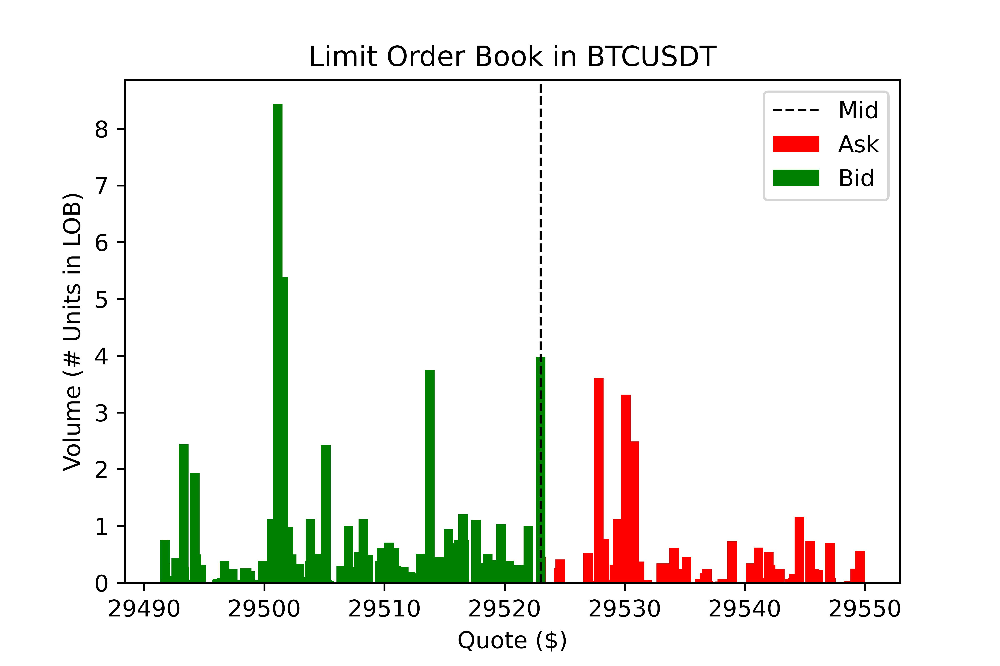
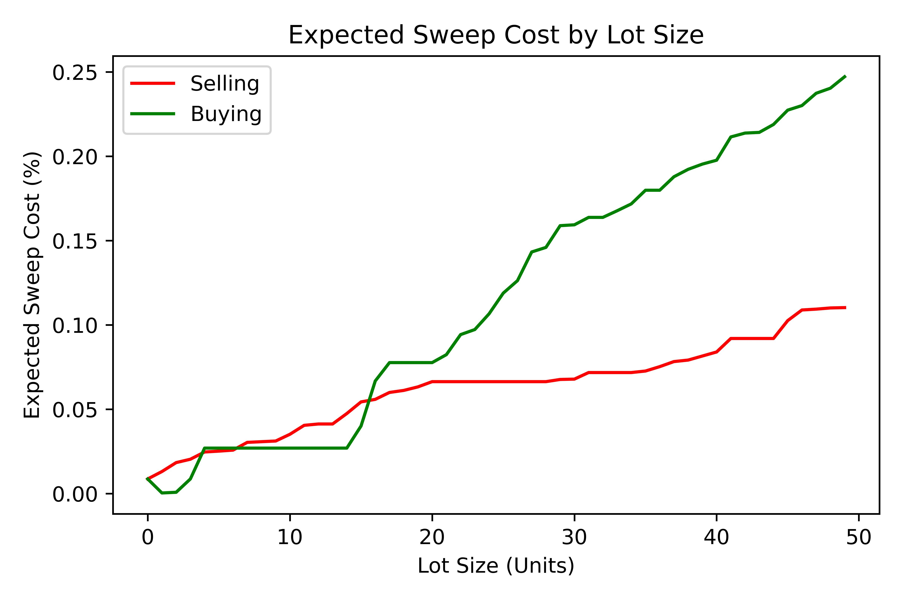

CTrader
=================
The CTrader component enables users to submit and manage orders on the exchange. This module interfaces with the 
Limit Order Book functionality provided by :code:`view_book` & :code:`get_quote`. Through this library users should
be able to quickly develop production ready algorithms. 

Setup & The Ledger
-------------------
In this library we have packaged a :code:`ledger` object alongside the :code:`client` such that building and calling complex, tick-accurate execution
algorithms is a simple process. Setting up these two objects is necessary when creating the enviornment to run the modules.
In order to build the ledger one needs to pass a list of symbols in String format however it is not necessary to use the ledger when using orders it just makes the process easier. 

.. code::

    client = CSuite.connect_client(filename)

    ledger = CSUite.build_ledger(client, symbols)

Orders & Order Entry
---------------------

The Order Engine
*****************
In certain cases it may be necessary that the order generation and submission is contained by a recording and managment object, in this case, that is the Order Engine.
As an object, it contains the :code:`client`, symbol and, :code:`ledger`` (see above) and can be used to expedite and manage order submission and execusion processes for users necessitating a more streamlined interface.

**Setting up the Engine:**
:code:`engine = OrderEngine(client, symbol, ledger)`

**Building an Order:**
:code:`order = engine.order(type, size)`

**Submitting the Order:**
:code:`order.submit()`

.. warning:: Iceberg orders are currently not supported

Limit Order
************
A limit order is a type of order to purchase or sell a security at a specified price or better. 
By using a buy limit order, the investor is guaranteed to pay that price or less. While the price is guaranteed, 
the filling of the order is not, and limit orders will not be executed unless the security price meets the 
order qualifications. If the asset does not reach the specified price, the order is not filled.

Limit Orders requires 6 parameters, the :code:`client` for data access and 4 order parameters. In limit orders a Limit Price (Price) is necessary
and so is a symbol (str) and the quatity, which is also used to specify trade direction, e.g. +10 (BUY) and -10 (SELL). 
The :code:`timeInForce` variable specifies the order enforcment and defualts to Good-Till-Cancel ('GTC'), it can be set to:

* **Good-Till-Cancel** ('GTC'): An order to buy or sell a security that lasts until the order is completed or canceled.
* **Fill-Or-Kill** ('FOK'): An order to buy or sell a security that must be executed immediately in its entirety; otherwise, the entire order will be cancelled.
* **Immediate-Or-Cancel** ('IOC'): An order to buy or sell a security that must be executed immediately. Any portion of an IOC order that cannot be filled immediately will be cancelled.

Limit Order support a stop through the :code:`stop`  parameter which has a defualt value of 0. The stop is set as a nominal (price) value which is automatically
converted into a TP or SL. For example passing a price of 100 and a stop of 120 would imply a Take Profit (TP), conversly a stop of 80 would imply a Stop Loss (SL)

+------------+------------+-----------+-----------+
| **Name**   | **Type**   |**Example**|**Default**|
+------------+------------+-----------+-----------+
| Price      | Float      | 0.5002    |  None     |
+------------+------------+-----------+-----------+
| Size (Qty) | Float      | 15 or -50 |  None     |
+------------+------------+-----------+-----------+
| Symbol     | String     | 'BTCUSDT' |  None     |
+------------+------------+-----------+-----------+
| stop       | Float      | 0,  1.25  |    0      |
+------------+------------+-----------+-----------+
| timeInForce| String     |'GTC' 'FOK'|   'GTC'   |
+------------+------------+-----------+-----------+

One can generate a simply Limit Order as such. For example to build an order for 1 BNB token at 0 with
no SL/TP and a 'GTC' time parameter.

.. code-block:: 
    
    order = CSuite.LimitOrder(client, 300.0, 1, 'BNBUSDT', 0, 'GTC')

.. note:: These methods are available across all order types (LMT, MKT, PST)

Submit
^^^^^^
To submit a built order to the Binance Exchange the submit method of the Limit Order can be used. It returns a filled order object with a
specified :code:`status` and :code:`orderId`.

.. code-block:: 
    
    sent_order = order.submit()

**Requires:** *None*

**Returns:** *obj: order*

Test
^^^^^
To validate a built order by submitting an identical test order the :code:`test()` method may be used. This is useful if order parameters must be verified fast
as the call and response takes a mere 200ms. :code:`test()` routes the order through the Exchange filters but not to the matchine engine. 
If the order is valid a '{}' is returned.

.. code-block:: 
    
    test_order = order.test()

**Requires:** *None*

**Returns:** *API response string*

Cancel
^^^^^^
To cancel a submitted order (one that has recived a valid :code:`orderId` variable) the cancel method can be used. This method returns the API response
string. 

.. code-block:: 
    
    status = order.cancel()

**Requires:** *None*

**Returns:** *order status string*

Verify
^^^^^^
This 

Market Order
************
A market order is an instruction by an investor to a broker to buy or sell stock shares, bonds, or other assets at the best available price in the current financial market.
It is the default choice for buying and selling for most investors most of the time.That means that a market order will be completed nearly instantaneously at a price very 
close to the latest posted price that the investor can see.

Market Orders requires 4 parameters, the :code:`client` for data access and 3 order parameters. In Market Orders passing a price is not necessary
and however a so is a symbol (str) and quatity must be set, with the latter being used to specify trade direction, e.g. +10 (BUY) and -10 (SELL). 
The :code:`timeInForce` parameter is not necessary as all Market Orders are flagged for immedate execution. 

Market Order supports a stop through the :code:`stop` parameter which has a defualt value of 0. The stop is set as a nominal (price) value which is automatically
converted into a TP or SL. For example passing a price of 100 and a stop of 120 would imply a Take Profit (TP), conversly a stop of 80 would imply a Stop Loss (SL)

+------------+------------+-----------+-----------+
| **Name**   | **Type**   |**Example**|**Default**|
+------------+------------+-----------+-----------+
| Size (Qty) | Float      | 15 or -50 |  None     |
+------------+------------+-----------+-----------+
| Symbol     | String     | 'BTCUSDT' |  None     |
+------------+------------+-----------+-----------+
| stop       | Float      | 0,  1.25  |    0      |
+------------+------------+-----------+-----------+

One can generate a simple Market Order as such. For example to build an order for 1 BNB token with no SL/TP.

.. code-block:: 
    
    order = CSuite.MarketOrder(client, 1, 'BNBUSDT', 0')

Post-Only Order
****************

A Post-Only order is a Limit Order which cannot be crossed with resting liquidity on the book, it can 
only cross against Market Orders thus, ensuring that the order is treated as a Maker order. 

Post-Only Orders requires 5 parameters, the :code:`client` for data access and 4 order parameters. In Limit orders passing a price is necessary
and however a so is a symbol (str) and quatity must be set, with the latter being used to specify trade direction, e.g. +10 (BUY) and -10 (SELL). 
The :code:`timeInForce` parameter is necessary but set to 'GTC' as defualt. 

Post-Only Orders do not support a stop through the :code:`stop`.

+------------+------------+-----------+-----------+
| **Name**   | **Type**   |**Example**|**Default**|
+------------+------------+-----------+-----------+
| Size (Qty) | Float      | 15 or -50 |  None     |
+------------+------------+-----------+-----------+
| Symbol     | String     | 'BTCUSDT' |  None     |
+------------+------------+-----------+-----------+
| stop       | Float      | 0,  1.25  |    0      |
+------------+------------+-----------+-----------+

One can generate a simple Market Order as such. For example to build an order for 1 BNB token with no SL/TP.

.. code-block:: 
    
    order = CSuite.MarketOrder(client, 1, 'BNBUSDT', 0')

Order Book Functions
---------------------

Build Ledger
*************
.. code-block::
    
    ledger = build_ledger(client, symbols)

This function recives and formats exchange information for a list of tradable tokens on the exchange. The ledger may be used to help pass variables into
execution algorithms. 

**Requires:** *obj: client*, *arr of str: symbols*

**Returns:** *Pandas DataFrame*

Plot Limit Order Book
**********************

This function allows users to quickly plot the current Limit Order Book (LOB) at a specified depth (:code:`limit`).

**Requires:** *obj: book*, *str: symbol*, *int: limit*, *bool: plot*, *bool: save*, *str: path*

**Returns:** *obj: book* & plots plt

Expected Sweep Cost 
*********************
.. code-block:: 

    esc = sweep_cost(book, size, symbol, side, ref)

This method returns the expected cost of sweeping the book with a specified size block. It requires a :code:`book` object which is the first (indx: 0) 
in the values returned by :code:`view_book`, the :code:`size` of the block order,
the :code:`symbol` is for display purposes while the :code:`side` specifies whether it is a 'BUY' or 'SELL' order. The :code:`ref` parameter specifies the 
starting reference price, for which are three options:

* **Bid** ('B'): Start at the best bid, calculates aggresive sells or passive buys.
* **Mid** ('M'): Start at the mid-point of the spread.
* **Ask** ('A'): Start at the best ask, calculates aggresive buys or passive sells.

**Requires:** *obj: book*, *float: size*, *str: symbol*, *str: side*, *str: ref*

**Returns:** *Pandas DataFrame*

Plot Expected Sweep Cost
*************************

This function utilises the Expected Sweep Cost (ESC) function above in order to calculate the cost of different sized blocks. This returns a plot which provides
insight into the depth of the LOB and cost of large transactions. 

**Requires:** *obj: book*, *str: symbol*, *int: max*, *int: inc*, *bool: plot*, *bool: save*, *str: path*

**Returns:** *None*

Order Execution Algorithms
---------------------------
Utilising the extensive wrapping of functionality we can provide packaged execution algorithms which can 
be worked with or without the :code:`OrderEngine`

Tick Match
***********
Tick Match (or Peg Match) is a propriatery high-speed, high-fill peg algorithm that requires no counterparty 
(i.e. executes in the market). Tick Match enables the trader to peg an order at a specific tick distance from the BBO. 
The algorithm executes by posting Limit Orders at a set distance from the BBO, say 2 or 3 ticks. Continous monitoring of 
each order is the defualt and the time until the order is force cancelled is set via the :code:`refresh` parameter. Each refresh cycle is
approx. 600ms. 

**Parameters**

+------------+------------+-----------+-----------+------------------------+
| **Name**   | **Type**   |**Example**|**Default**|  **Decription**        |
+------------+------------+-----------+-----------+------------------------+
| client     | Client     | Object    |  None     | API client             |
+------------+------------+-----------+-----------+------------------------+
| symbol     | String     | 'BTCUSDT' |  None     | Binance symbol str     |
+------------+------------+-----------+-----------+------------------------+
| size (qty) | Float      | 0,  1.25  |    0      | Order qty (neg = sell) |
+------------+------------+-----------+-----------+------------------------+
| tickSize   | Float      | 0.0001    |    0      | min tradable tick      |
+------------+------------+-----------+-----------+------------------------+
| distance   | int        | 1, 12     |    5      | tick distance from BBO |
+------------+------------+-----------+-----------+------------------------+
| retry      | int        | 5,  25    |    10     |num of order submissions|
+------------+------------+-----------+-----------+------------------------+
| refresh    | int        | 1, 3      |    1      |num of monitor cycles   |
+------------+------------+-----------+-----------+------------------------+

**Returns**

Execution algorithms generally return an execution record comprised out of the BBO at execution time coupled with the orderId. 

Direct Access
^^^^^^^^^^^^^^^

.. code-block:: 

    execution = CSUite.tick_match(client, symbol='BNBUSDT', size=1, tickSize=0.001, distance=3, retry=10, refresh=2)

Example code for running the algo to buy 1 'BNB' token by sending 10 consecutive orders each at 3 ticks from the BBO. Furthermore, each order is monitored
twice (specified via refresh) before forced cancelled if not filled. 

via OrderEngine Wrapper
^^^^^^^^^^^^^^^^^^^^^^^^

.. code-block:: 

    engine = OrderEngine(client, 'BTCUSDT', ledger)
    execution = engine.tick_match(size=0.02, distance=3, retry=10, refresh=1)

Mid-Point Match
***************
Mid-Point Market is a propriatery neutral high-fill rate algorithm designed for immediate execution in mean-reversion strategies. This algorithm posts aggressive limit orders 
at the mid-point (if it exists) or the best side BBO - i.e. if buy then best bid, if sell then best ask. 

+------------+------------+-----------+-----------+------------------------+
| **Name**   | **Type**   |**Example**|**Default**|  **Decription**        |
+------------+------------+-----------+-----------+------------------------+
| client     | Client     | Object    |  None     | API client             |
+------------+------------+-----------+-----------+------------------------+
| symbol     | String     | 'BTCUSDT' |  None     | Binance symbol str     |
+------------+------------+-----------+-----------+------------------------+
| size (qty) | Float      | 0,  1.25  |    0      | Order qty (neg = sell) |
+------------+------------+-----------+-----------+------------------------+
| tickSize   | Float      | 0.0001    |    0      | min tradable tick      |
+------------+------------+-----------+-----------+------------------------+
| retry      | int        | 5,  25    |    10     |num of order submissions|
+------------+------------+-----------+-----------+------------------------+

Direct Access
^^^^^^^^^^^^^^

.. code-block::
    
    execution = CSUite.midpoint_match(client, symbol, size, tickSize, retry)

via OrderEngine Wrapper
^^^^^^^^^^^^^^^^^^^^^^^^

.. code-block:: 

    engine = OrderEngine(client, 'ADAUSDT', ledger)
    execution = engine.midpoint_match(size=50, retry=10)

Mini-Lot
********
Mini-Lot is a special excution algorithm dealing in mini-lots (i.e. lots close as possible to the :code:`minNotiona`). It places Immediate-Or-Cancel (IOC) 
orders at the BBO without crossing the spread, acting somewhat passively. This algorithm may be used to immediately acquire small quantities either to run small
systematic trading accounts, or

+------------+------------+-----------+-----------+------------------------+
| **Name**   | **Type**   |**Example**|**Default**|  **Decription**        |
+------------+------------+-----------+-----------+------------------------+
| client     | Client     | Object    |  None     | API client             |
+------------+------------+-----------+-----------+------------------------+
| symbol     | String     | 'BTCUSDT' |  None     | Binance symbol str     |
+------------+------------+-----------+-----------+------------------------+
| size (qty) | Float      | 0,  1.25  |    0      | Order qty (neg = sell) |
+------------+------------+-----------+-----------+------------------------+
| tickSize   | Float      | 0.001     |    0      | min tradable tick      |
+------------+------------+-----------+-----------+------------------------+
| stepSize   | Float      | 0.1       |    0.1    | min Qty step size      |
+------------+------------+-----------+-----------+------------------------+
| minNotional| Float      | 5,  25    |    10.0   | min total order value  |
+------------+------------+-----------+-----------+------------------------+
| retry      | int        | 1, 3      |    10     |num of order submissions|
+------------+------------+-----------+-----------+------------------------+

Direct Access
^^^^^^^^^^^^^^

.. code-block::
    
    execution = CSUite.mini_lot(client, symbol, size, tickSize, setpSize, minNotional, retry)

via OrderEngine Wrapper
^^^^^^^^^^^^^^^^^^^^^^^^

.. code-block:: 

    engine = OrderEngine(client, symbol, ledger)
    execution = engine.mini_lot(size, retry)

Breakeven
**********
The Breakeven order algorithm is an algorithm which creates a mirror breakeven to an executed order, accounting for two way commission. It can enable users to 
instantly build and submit mirror orders to close open balances when trading net-0 strategies. To better account for the needs of algorithmic traders the algorithm
contains an offset parameter which specifies an additional move of the Limit Price into a value above breakeven.

+------------+------------+-----------+-----------+------------------------+
| **Name**   | **Type**   |**Example**|**Default**|  **Decription**        |
+------------+------------+-----------+-----------+------------------------+
| client     | Client     | Object    |  None     | API client             |
+------------+------------+-----------+-----------+------------------------+
| symbol     | String     | 'BTCUSDT' |  None     | Binance symbol str     |
+------------+------------+-----------+-----------+------------------------+
| orderId    | String     | 0,  1.25  |    0      | Order qty (neg = sell) |
+------------+------------+-----------+-----------+------------------------+
| offset     | int        | 1         |    0      | offset from breakeven  |
+------------+------------+-----------+-----------+------------------------+
| tickSize   | Float      | 0.001     |    0      | min tradable tick      |
+------------+------------+-----------+-----------+------------------------+
| stepSize   | Float      | 0.1       |    0.1    | min Qty step size      |
+------------+------------+-----------+-----------+------------------------+

Direct Access
^^^^^^^^^^^^^^

.. code-block::
    
    order = CSUite.breakeven(client, symbol, orderId, offset, tickSize, stepSize)

via OrderEngine Wrapper
^^^^^^^^^^^^^^^^^^^^^^^^

.. code-block:: 

    engine = OrderEngine(client, symbol, ledger)
    order = engine.breakeven(orderId, offset=0)

