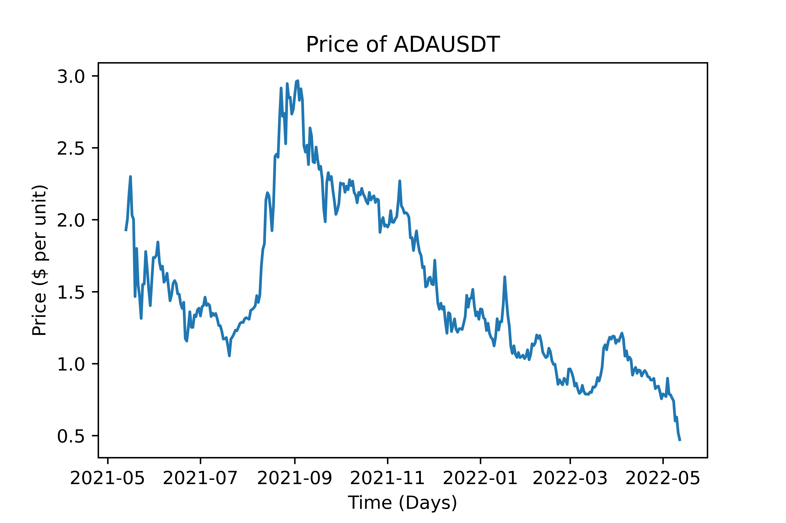
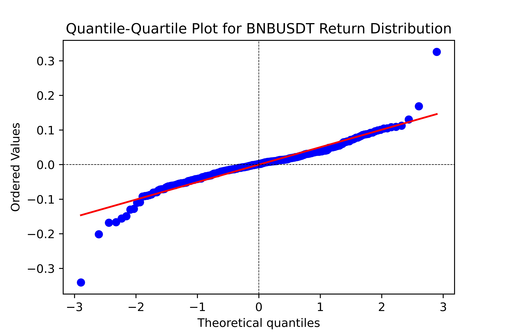
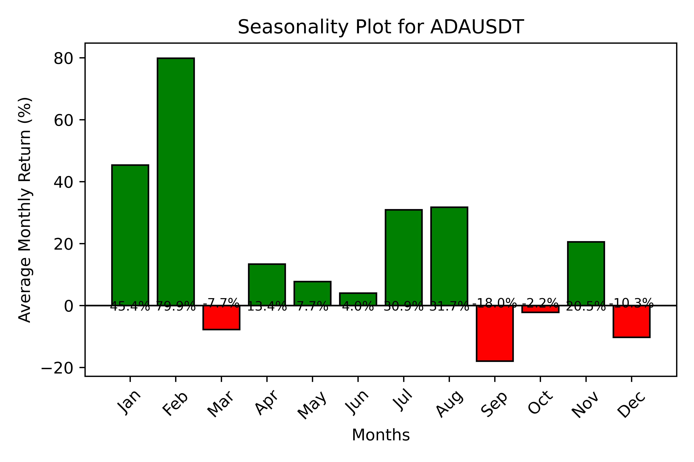
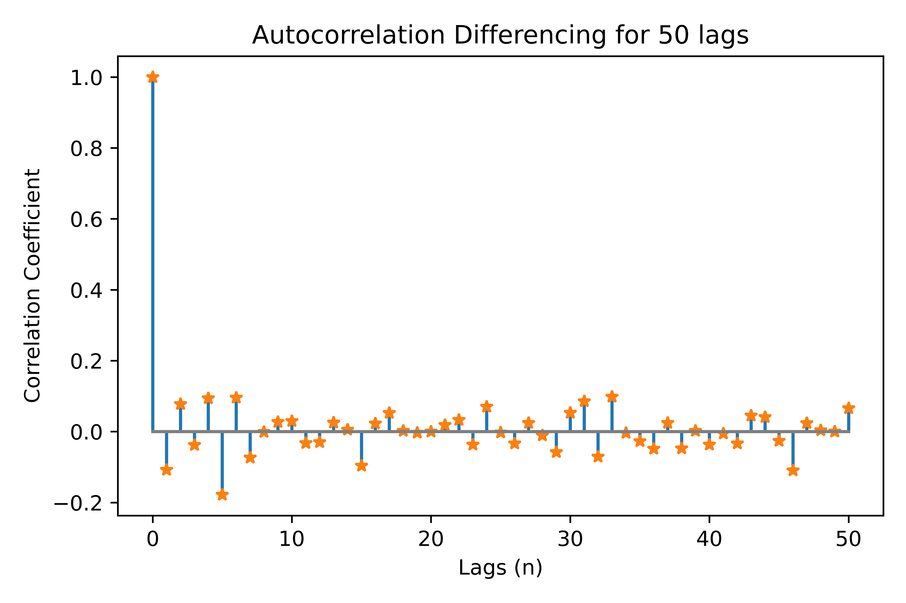
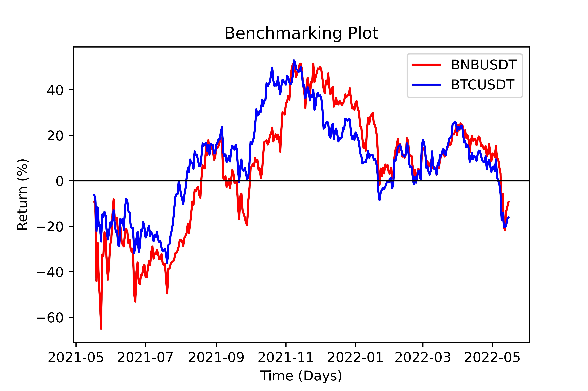

CTester
=================

Handing Timeseries
-------------------
We provide a Timeseries wrapper in the :code:`TimeSeries` object which can be used
to atain information on a specified timeseries which can be passed normally as a pair OCHL or a custom pandas DataFrame.
Investigating the properties of investable timeseries has never been easier!

.. code-block:: 

    timeSeries = TimeSeries(client, data=pd.DataFrame())

A :code:`TimeSeries()` requires a :code:`client` object and an optional :code:`data` input to calculate values from. The TimeSeries can be
filled with the appropriate data using a custom pass argument on :code:`data` or via the standard :code:`download()` function. 
Each TimeSeries contains 5 internal variables these being:

+------------+------------+-----------+-----------+------------------------------------+
| **Name**   | **Type**   |**Example**|**Default**|  **Decription**                    |
+------------+------------+-----------+-----------+------------------------------------+
| *client*   | Client     | Object    |  None     | API client                         |
+------------+------------+-----------+-----------+------------------------------------+
| *data*     | DataFrame  | pd.frame  |  None     |pd.DataFrame containing TimeSeries  |
+------------+------------+-----------+-----------+------------------------------------+
| *col*      | String     |'adj_close'|  'close'  | Frame to Series pointer            |
+------------+------------+-----------+-----------+------------------------------------+
| *symbol*   | String     | 'BTCUSDT' |  None     |TimeSeries name                     |
+------------+------------+-----------+-----------+------------------------------------+
| *interval* | String     | '1d'      |  None     |Specifies timeseries interval       |
+------------+------------+-----------+-----------+------------------------------------+

Download
***********
.. code:: 

    timeSeries = TimeSeries.download(symbol, interval)

This method passes data into the :code:`data` field using the :code:`get_SpotKlines()` to download OCHL data. It 
requires the *symbol* and *interval* like the pre-mentioned funcion.

**Requires:** *str: symbol*, *str: interval*

**Returns:** *Self*

Slice
********
.. code::

    TimeSeries = TimeSeries.slice(col)

This method changes the *col* parameter of the :code:`TimeSeries` object which dictates which column of the DataFrame passed in
*data* is used to make the singular TimeSeries for calculations. 

**Requires:** *str: col*

**Returns:** *self* 

Summarize
***********
.. code::
    
    summary = TimeSeries.summarize(period=365, pct=False)

The :code:`summary()` method returns a formatted DataFrame of summary statistics for the timeseries.
The :code:`pct` parameter Specifies if the data passed is in price or percentage terms. 

+--------+------------+--------+---------+-------------+--------+------+----------+
| Return | Volatility | Sharpe | Sortino | MaxDrawDown | Calmar | Skew | Kurtosis |
+--------+------------+--------+---------+-------------+--------+------+----------+

**Requires:** *int: period*, *bool: pct*

**Returns:** *Pandas DataFrame*

Linear Regression
******************
.. code:: 

    est = TimeSeries.lin_reg(period=365)

This method returns the estimated annualised returns using Linear Regression.

**Requires:** *int: period*

**Returns:** *float*

Seasonality
************
.. code:: 

    szn = TimeSeries.seasonality()

This method returns a Panadas DataFrame with the average performed return by buissness month over the history of the timeSeries. 
This only works for intervals of '1d' or more. 

**Requires:** *None*

**Returns:** *Pandas DataFrame*

Autocorrelation
****************
.. code:: 

    acf = TimeSeries.autocorrelation(period=365, lags=50, diff=False)

Returns autocorrrelation estimation across different lags as specified in the *lag* parameter.
Autocorrelation differencing is possible by enabling the *diff* parameter. 

**Requires:** *int: period*, *int: lags*, *bool: diff*

**Returns:** *Pandas DataFrame*

A.D. Fuller
************
.. code:: 

    adf = TimeSeries.adfuller(maxlags=5, mode='L', regression='ct')

This method performs the A.D. Fuller test using the `statsmodels adf module <https://www.statsmodels.org/dev/generated/statsmodels.tsa.stattools.adfuller.html#statsmodels.tsa.stattools.adfuller>`_ 
and returns a Pandas DataFrame of relevant values as shown below. The regression input is directly related to the statsmodels implementation and represents the type of 
regression calculated.

+-----------+---------+------+--------+---------+----------+----------+----+
| ADF Value | P-Value | Lags | N Obs  | C.V. 1% | C.V. 5%  | C.V. 10% | IC |
+-----------+---------+------+--------+---------+----------+----------+----+

The A.D. Fuller test supports multiple price calculation methods, we have simplified the application
of Logarithmic price transformation for the test through the *mode* parameter.  

**Acceptable Modes**

* **Nominal** ('N'): Standard non-normalised price as downloaded via OCHL & sliced using *col*
* **Logarithmic** ('L'): Applies Logarithmic transformation to prices. 

**Requires:** *int: maxlags*, *str: mode*, *str: regression*

**Returns:** *Pandas DataFrame* 

Plotting Timeseries
-------------------

.. code-block:: 

    plotter = Plotter(TimeSeries, path)

TimeSeries Plots
****************
.. code-block:: 

    Plotter(TimeSeries).plot(period, mode, save)

This function enables plotting of a timeSeries and automates conversion into either *Returns* or
*Volatility* via the *mode* parameter. This is a simplified way to see the basic (Level I) timeseries data.

**Acceptable Modes**

* **Nominal** ('N'): Plots the prices in standard nominal format.
* **Returns** ('R'): Plots the return as % gain/loss since period start.
* **Volatility** ('V'): Plots 7-day rolling standard deviation (Volatility) since period start.

**Requires:** *int: period*, *str: mode*, *bool: save*

**Returns:** *Null*

Quantile Plots
**************
.. code-block:: 

    Plotter(TimeSeries).plot_qq(period, mode, save)

This function plots *Quantile-Quantile* with reference to normal distributions for quick analysis of 
the Return or Volatility distributions. 

**Acceptable Modes**

* **Returns** ('R'): Plots the distribution of returns.
* **Volatility** ('V'): Plots the distribution of volatility. 

**Requires:** *int: period*, *str: mode*, *bool: save*

**Returns:** *Null*

Seasonality Plot
*****************
.. code-block:: 

    Plotter(TimeSeries).plot_seasonality(save)

This function plots the seasonality statistic, i.e. the average performed monthly return of the timeseries. 
It shows a matplotlib barplot with relevant information which can be saved. 

**Requires:** *bool: save*

**Returns:** *Null*

Autocorrelation Plot
********************
.. code-block:: 

    Plotter(TimeSeries).plot_acf(period, lags, diff, save)

This function plots the autocorrelation for specified lags; it can plot differenced autocorrelation by enabling the :code:`diff` parameter.
It shows a matplotlib stemplot which can be saved. 

**Requires:** *int: period*, *int: lags*, *bool: diff*, *bool: save*

**Returns:** *Null*

Benchmark Plot
**************
.. code-block:: 

    Plotter(TimeSeries).benchmark(benchmark, period, delta, save)

This function plots the specified timeseries against a benchmark timeseries. It may return the 1:1 spread (delta) between the two timeseries via 
the :code:`delta` parameter. It shows a matplotlib lineplot which can be saved.

**Requires:** *str: benchmark*, *int: period*, *bool: delta*, *bool: save*

**Returns:** *Null*

Handling Portfolios
--------------------
We have packaged additional functionality through the :code:`Portfolio` object which enables users to calculate performance analyses on portfolios. 
Through this object, it is possible to define and parameterise portfolio level quantitative data-points. This is also connected to the portoflio backtesting suite
via the :code:`MonteCarlo` engine. 

.. code-block:: 

    portfolio = Portfolio(client, symbols, weights, interval, download)

In the above statement, there is a simple definition of a portfolio, it contains a list of symbols and coresponding weights, a timeseries interval and a download check. 
First, the :code:`symbols` need always get passed and represent the basic parameter of the portfolio. Second, the :code:`weights` parameter needs to be an array of floats summing to 1; however,
if it ommitted it is automatically set to equal weighting across symbols. Third, the :code:`interval` paarameter represents the timeseries interval for the download, if the :code:`donwload` parameter is 
False then :code:`interval` is ommitted. In the cases where :code:`download` is false, the :code:`weights` & :code:`interval` may be ommitted. 

The input format for the :code:`data` parameter is a *Pandas DataFrame* with each column being a select single-variable timeseries of each asset, with the columns being the tickers. 

+------------+------------+-----------+-----------+------------------------------------+
| **Name**   | **Type**   |**Example**|**Default**|  **Decription**                    |
+------------+------------+-----------+-----------+------------------------------------+
| *client*   | Client     | Object    |  None     | API client                         |
+------------+------------+-----------+-----------+------------------------------------+
| *symbols*  |str array   |['ADAUSDT']|  None     |pd.DataFrame containing TimeSeries  |
+------------+------------+-----------+-----------+------------------------------------+
| *weights*  | float array|[0.3, 0.7] |  None     | Frame to Series pointer            |
+------------+------------+-----------+-----------+------------------------------------+
| *interval* | String     | '1d'      |  None     |Specifies timeseries interval       |
+------------+------------+-----------+-----------+------------------------------------+
| *download* | bool       | True      |  True     |  Download timeseries data or not?  |
+------------+------------+-----------+-----------+------------------------------------+

Calculte Equity Curve
**********************

.. code-block:: 

    eqCurve = Portfolio.equity_curve(period=365)

This method returns the cummulative return ('Equity Curve') of the calculated portfolio by parsing :code:`data` against :code:`weights`.
It returns a timeseries DataFrame with timestamps and return values.  

**Requires:** *int: period*

**Returns** *Pandas DataFrame*

Load Data
*********
.. code-block:: 

    Portfolio = Portfolio.load_data(data)

This method enables us to bypass the data download phase of the portfolio by loading the :code:`data` object discretely.

**Requires::** *Pandas DataFrame: data*

**Returns:** *obj: Portfolio*

Summarize
**********
.. code-block:: 

    summary = Portfolio.summarize(period=365)

This method returns a number of summary statistics of the specified Portfolio timeseries which can help in quantitative analysis. The return fields
can be seen in the table below. *Expected* values represent calculations derived from the Mean. The Sortino, Draw Down, Calmar, Skew and Kurtosis, measures
are derived from the full timeseries. The *Performed* values (Return, Vol, Sharpe) are calculated using the :code:`period` parameter 
(i.e. 'PerformedReturn' for a period of 365 is 1YR return)

+-----------+----------+----------+-------------+---------+-------+--------+--------+------+--------+----+--------+
| Weights   | Exp. Ret | Exp. Vol | Exp. Sharpe | Sortino | MaxDD | Calmar | Return | Vol. | Sharpe |Skew|Kurtosis|
+-----------+----------+----------+-------------+---------+-------+--------+--------+------+--------+----+--------+

**Requires:** *int: period*

**Returns** *Pandas DataFrame*

Long Only Portfolio Backtesting
--------------------------------
.. code-block:: 

    mcEngine = MonteCarlo(client, symbols)

The Monte Carlo Engine provides an efficient way for us to run Simulation of portfolio performance through shifting the
:code:`weights` parameter. Through this wrapper we can view certain optimisation functionality aimed at **Long-Only Portfolios**.

**Requires:** *obj: client*, *arr of str: symbols*

**Returns** *obj: MonteCarlo*

Run Simulation
***************
.. code-block:: 

    mcEngine = mcEngine.run(runs=5000)

This method enables users to backtest the historic performance of randomly weighted portfolios of the specified symbols. The outcome of this method 
is a filled *Pandas DataFrame* containing the timeseries information calculated via :code:`summary()` in the *timeseries* package. It also includes an 
annualised expected calcuation of returns, volatility and sharpe by extrapolating the returns distribution. 

**Requires:** *int: runs*

**Returns** *obj: MonteCarlo*

Efficient Frontier
******************
.. code-block:: 

    mcEngine.eft(mode='E')

This method returns the top-5 results calculated through :code:`run()` as per the Efficient Frontier Theory; that being sorted by Sharpe ratio.
We provide the :code:`mode` parameter such that the sorting may be done via exppected returns or 1 year performed returns.

**Acceptable Modes**

* **Expected** ('E'): Returns the top-5 portfolios based on expected sharpe ratio of all timeseries data.
* **Performed** ('P'): Returns the top-5 portfolios based on 1 year performed sharpe.

**Requires:** *str: mode*

**Returns** *Pandas DataFrame*

Pairs Trading
--------------
.. code-block::

    pair = CSuite.Pair(client, symbols, interval, download)

We include a specialised Pairs Trading handler that allows users to easily analyse pair trading and other spread based startegies. A :code:`Pair` object 
contains a customisable :code:`data` structure of DataFrame type, alongside a client, symbols and, an interval string.
It is initailized with the :code:`download` parameter which specifies whether the data filed is filled using the :code:`batch_historic` function. 

**Requires:** *obj: client*, *arr str: symbols*, *str: interval*, *bool: download*

**Retuns:** *obj: Pair*

The Spread
***********
.. code-block::

    spread = pair.get_spread()

A Pair contains a spread which is the difference in daily closing prices between the two timeseries. Since this in itself is a timeseries, it is a child class
of the :code:`timeseries` object and can utilise functions like :code:`summarize` or :code:`adfuller`. The Spread can be created through the Pair object:

.. note:: The :code:`Spread` can be plotted using the :code:`Plotter`

**Requires:** *None*

**Returns:** *obj: Spread*

Johansen test
^^^^^^^^^^^^^^
.. code-block:: 
    
    spread.johansen(maxLags=20)

**Requires:** *int: maxLags*

**Return:** *null*

VCEM Forecast
^^^^^^^^^^^^^
.. code-block::

    forecast = spread.VCEM_forecast(periods, lags, coints, backtest=False, confi=0.05, determ='ci')

The :code:`VCEM_forecast` method enables users to easy get a forward prediction of a cointegratable spread using the Vector Error Correction Model.  

**Requires:** *int: periods*, *int: lags*, *int: coints*, *bool: backtest*, *float: confi*, *str: determ*

**Returns:** *DataFrame: forecast*